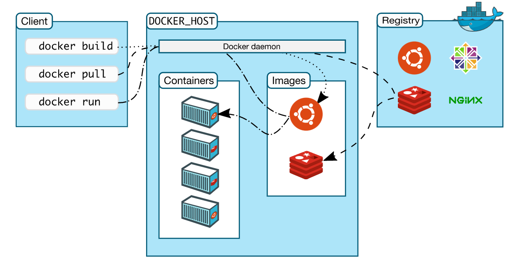

# 🐳 Docker

**Docker** is an open-source containerization platform used to deploy and run applications inside isolated environments called containers.

➤ A Docker container is a lightweight, portable, and isolated environment used to run an application. It packages the application along with all its dependencies, libraries, and configuration files, ensuring it to run any environments by sharing the host operating system's kernel making them more fast and efficient.

---

## ✅ Advantages :

- Lightweight (Containers share the host OS kernel), and fast (start much faster than virtual machines).  
- Isolated from other containers.  
- Scalable (Easy to scale up/down services in response to demand with orchestration tools like Kubernetes).  
- Portable (containers run consistently on any system).

---

## ❌ Disadvantages :

- Less secure than VMs (shares host OS)  
- Complex to manage at large scale (needs orchestration)  
- Limited GUI support.

---

## * Docker Architecture: 
Docker follows a client-server architecture  
- **Docker Client** : sends commands to the docker Daemon like docker run.  
- **Docker Daemon** : Receives the command and executes then creates images and containers.  
- **Docker Host**   : Physical or virtual server where docker is installed.  
- **Docker Registry** : Stores and shares the docker images.  

---

## components of Docker:

---

### ➤ Docker Engine :
Docker Engine is a core component of Docker system that runs on a host machine to build, run, and manage Docker containers.

#### 🤔How Docker Engine works : 

- You use the Docker CLI to give instructions, like docker run or docker build.  
- The Docker CLI sends these commands to the Docker daemon which runs in the background.  
- The Docker daemon processes the commands it builds images, creates containers, starts or stops them, and manages resources.  
- When you run a container, Docker Engine uses the host OS kernel to isolate the container’s.  
- Docker Engine enables the communication between containers.

---

### ➤ Docker Image :
Docker images are read-only templates used to create Docker containers. Image contains application code, libraries, system tools.  
- Once created, the image doesn’t change (Immutable)  
- Stored locally or registry (Docker Hub).

#### 🤔How Docker Image works : 

- You use the Docker CLI to give instructions like docker run nginx (or) docker pull nginx.  
- Docker checks locally to see if the nginx image exists.  
- Image not found locally Docker automatically pulls (downloads) the image from Docker Hub.  
- Once downloaded, the image is saved locally and then Docker runs a container from it.

---

### ➤ Docker Container :
A runnable instance of docker image. Lightweight and portable used to deploying applications.

---

### ➤ Docker Daemon :
Docker Daemon is the background service of Docker that manages the docker components like containers, volumes, images and Networking.  
- Listens to requests from the docker client via the Docker API.

---

### ➤ Docker Client :
Docker Client (CLI - Command line interface) used to interact with Docker.  
- Sends those commands to the Docker Daemon like (like docker run, docker build, docker pull).

---

### ➤ Docker Registry :
Docker Registry is a repository to store and distribute the Docker images.  
- Docker Hub is default public registry  
- Allows pushing images from your local system  
- Allows pulling images to run containers.

---

### ➤ Docker Volume :
Docker Volumes is persistent storage mechanism for Docker.  
- container data is not lost when containers stop or are removed  
- volumes can be shared between multiple containers.  
- It stores your data outside the container, so it’s safe even if the container is deleted.

---

### ➤ Docker file :
A Docker file is a text file that contains a set of instructions used by Docker to build a custom image.  
- common instructions are like FROM, COPY, RUN, CMD, EXPOSE, WORKDIR.

---

### ➤ Docker Compose :
Docker Compose is a tool used to define and run multi-container Docker applications using a single YAML file (docker-compose.yml).  
- Instead of starting each container manually with docker run, you can use one command docker-compose up.  
- Starting/stopping all services together.

---

### ➤ Docker Objects :
Docker uses several objects to manage environments.  
- Images  
- Containers  
- Volumes  
- Networks

---

### ➤ Docker Host :
Docker Host is the physical or virtual server where docker is installed.

---

## 🔐 Docker Best Practices :
- Use multi-stage builds to separate build and runtime environments.  
- use official images.  
- Use small base images (e.g., alpine) to reduce size.  
- Avoid running containers as root; use a non-root user.  
- Use container Networks and firewalls.
