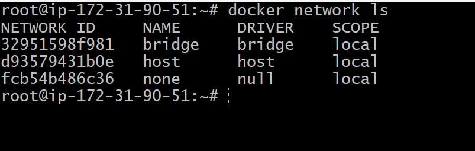
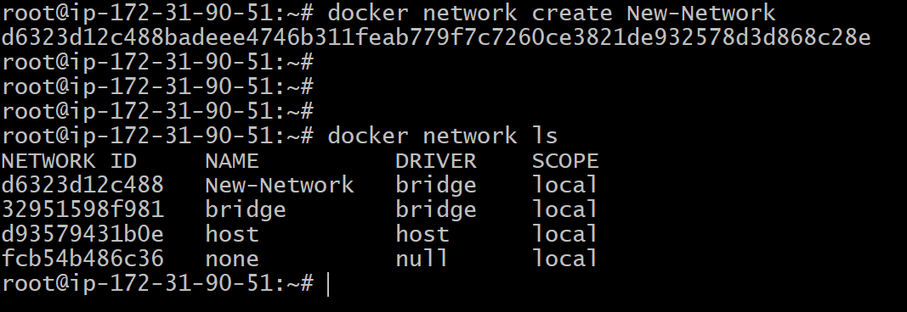
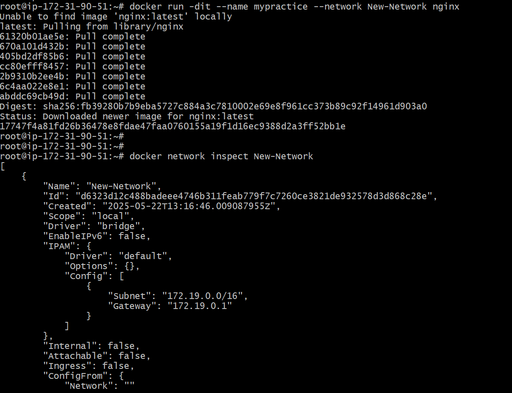
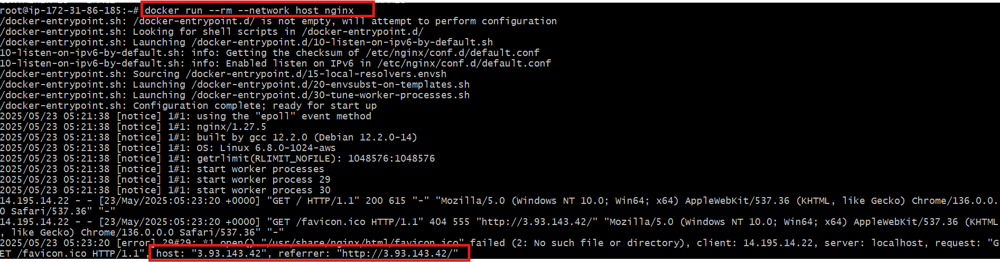
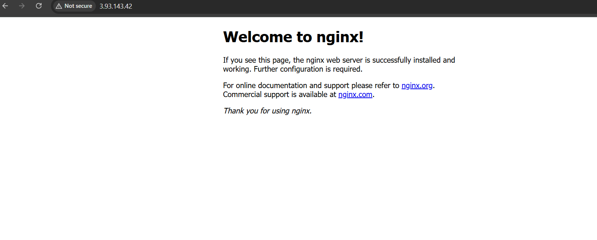
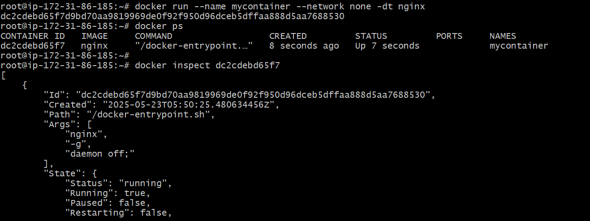
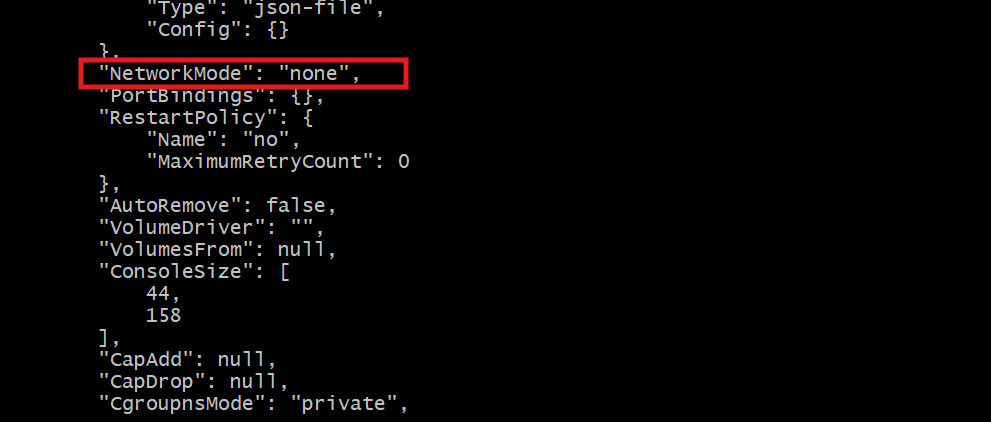

# 🐳 Docker Networking🌐:

Docker networking is how Docker containers communicate with each other, with the host machine, and with the outside world (internet or other networks).
→ When you create containers, Docker automatically connects them to a default network unless you specify otherwise.
→ You can also create custom networks to control how containers talk to each other.

## ➤ Why🤔is Docker Networking:

→ Enables communication between containers (e.g., web server container talking to a database container).
→ Defines how and which container ports are published to the outside world.
→ Provides isolation and security between containers.

## ➤ Types of Docker Networks : Docker has 4 main types of networks by default.

### 1️⃣. bridge (default) network :

Bridge network is Docker’s default private network where containers on the same host can communicate with each other using IP addresses.
→ When you start a container without specifying a network, it connects to this default bridge network.
→ Requires port mapping to access containers externally.

**Reason for Use:**
→ To isolate container traffic from the host and other networks.
→ To allow containers on the same host to communicate securely.

### 2️⃣ . host network :

The container shares the host’s networking namespace. No network isolation, the container uses the host’s IP address and ports directly.
→ Ports do not need to be published explicitly.

**Reason for Use:**
→ When a container needs direct access to the host’s network interfaces.
→ For applications that require low latency.

### 3️⃣. none network :

The container has no network.
→ Container is completely isolated from any network.
→ No communication with other containers or the outside world.

**Reason for Use:**
→ Useful for running containers without network access.

### 4️⃣. overlay network :

Enables communication between containers running on different Docker hosts.
→ Used mainly in Docker Swarm or Kubernetes clusters.

**Reason for Use:**
→ For multi-host container deployments, such as in orchestration platforms or clusters.

**Note** : You cannot remove Docker’s default networks (bridge, host, and none) because they are built-in and essential for Docker to function properly.

---

## Understand How Networking Work's - Practically :

### \* Check the Default Networks which is available by default.

```bash
docker network ls
```


* when we check with this command shows default networks — bridge, host, and none this are default Docker networks automatically created by Docker when you install it.

---

##  Let's Understand about Bridge Network:

### ➤ Create a Custom Bridge Network using:

```bash
docker network create my-Network
```


### ➤ Run a Container and Attach to the Custom Network using:

```bash
docker run -dit --name mypractice --network New-Network nginx
```

* `-d` runs the container in detached mode (in the background)
* `-i` keeps STDIN open
* `-t` allocates a terminal
* `--name mypractice` names the container nginx
* `--network New-Network` connects the container to your custom network

### ➤ Verify the Container is Connected to Your Network:

```bash
docker inspect my-Network
```


---

## Let'S know about Host-Network :

### ➤ Create and Use Docker Host Network:

Actually, you don’t need to create a host network — Docker already provides it by default.

### 🔹 Step 1: Check Available Networks

```bash
docker network ls
```

You will see something like:

```
NETWORK ID     NAME      DRIVER    SCOPE  
abc123456789   bridge    bridge    local  
def987654321   host      host      local  
```

### 🔹 Step 2: Use the Host Network

You can run any container using the host network:

```bash
docker run --rm --network host nginx
```

✅ Explanation of Each Part:

* `docker run` : Start a new container
* `--rm` Automatically remove the container when it stops
* `--network host` : Use the host’s network stack (not Docker’s virtual bridge)
* `<image-name>` The Docker image you want to run (e.g., nginx)

This will start Nginx using the host’s network, not Docker’s bridge network.


### 🔹 Step 3: You can then access it via:

```
http://localhost:<port>
```


⚠️ Why Use `--rm`?

* Keeps things clean — no leftover containers.
* Useful for testing or temporary services.

🛑 You cannot create another host network — Docker allows only one host network per host (because it's directly tied to the OS network stack).

---

## Let's Know about Docker None Network:

### 🔹 Step 1: Run a Container with none Network

```bash
docker run --name mycontainer --network none -dt nginx
```


✅ What This Command Does :

* `docker run` : Runs a new container
* `--name mycontainer` Names the container mycontainer
* `--network none` Disables all networking (no internet, no ports, no communication)
* `-d` Runs in detached mode (in the background)
* `-t` Allocates a pseudo-TTY (usually for interactive use, not needed here)
* `nginx` Uses the nginx image to run a web server

### 🔹 Step 2 : Check the network :

```bash
docker inspect container id or image-name
```


