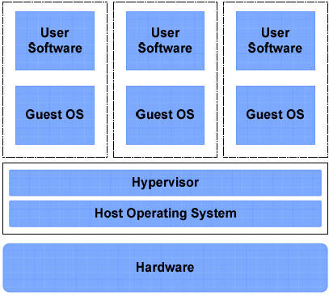
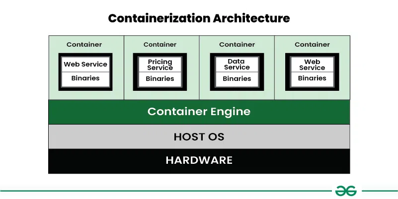
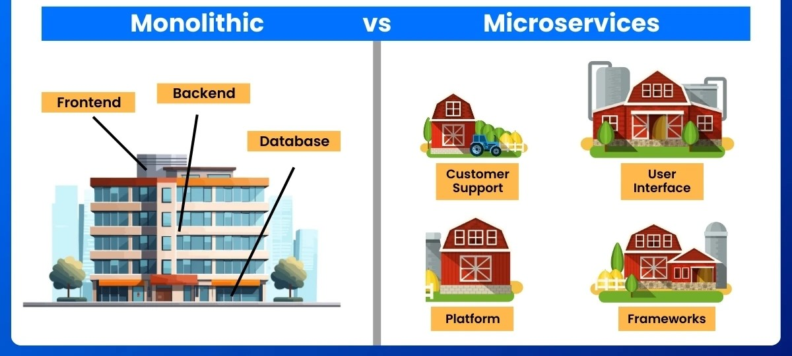

# * Virtualization vs containerization & Monolithic vs Microservices Architecture *

Virtualization and containerization are both methods of running multiple applications on a single physical server, but they differ in how they isolate and share resources.

** * Virtualiztion :** Virtualization is the process of creating virtual machines using a hypervisor, allowing multiple operating systems and applications to run independently on a single physical server.

**➤ Virtualization** is well-suited for monolithic applications because they need a full operating system, dedicated resources, and strong isolation.

**➤ Hypervisor:** A hypervisor is software, that manages the virtual machines and allocates resources like CPU, memory, and storage.

**🧠 Real-life Example:**  
You have 1 physical laptop  
You install a hypervisor  
You create 3 virtual machines: One with Ubuntu, One with Windows, One with CentOS → All run at the same time on your laptop!

**Virtual Machine (VM)**  
➤ It’s not a real physical computer, But it behaves just like one using software.

➤ virtual machine includes Virtual CPU, Virtual Memory(Ram), Virtual Storage, Virtual Network, Operating system.

➤Virtualization is well-suited for monolithic applications 

**✅Advantages :**

→ Run multiple apps on one machine.  
→ Cost-effective.  
→ Provides complete Isolation.  
→ Quick backup and recovery.

**❌ Disadvantages :**

→ If we have more vm's we need more setup and monitoring.  
→ Performance depends on the physical server’s power.  
→  VMs need extra storage space.

**Conclusion :** Maintaining virtualization environments more expensive due to the need for hardware maintenance and resource management.

---

** * Contenerization :** Containerization is a way to packaging an application along with its dependencies into a single container, ensuring it to run any environments by sharing the host 
                    operating system's kernel.

**➤ Containerization** is well-suited for microservices-based applications because they need lightweight, portable environments, fast startup, and independent deployment for each service.

**🧠 Real-life Example :**  
You have 1 physical laptop (Host Machine)  
You install Docker (Container Engine)  
You create 3 containers: One running a Python app, One running a Node.js app, One running a MySQL database → All 3 containers run at the same time on your laptop, sharing the same OS kernel, but they are isolated from each other!

**➤ Container :** A Docker container is a lightweight, portable, and isolated environment used to run an application. It packages the application along with all its dependencies, libraries,
              and configuration files, ensuring it to run any environments.

**✅ Advantages :** 

→ Lightweight(Containers share the host OS kernel), and fast(start much faster than virtual machines).  
→ Isolated from other containers.  
→ Scalable (Easy to scale up/down services in response to demand with orchestration tools like kubernetes.  
→ Portable (containers run consistently on any system)

**❌ Disadvantages :**

→ Less secure than VMs (shares host OS)  
→ Complex to manage at large scale (needs orchestration)  
→ Limited GUI support.

---

**Monolithic Architecture:** A monolithic architecture is a software design where all components of an application such as frontend, backend, and database are built and deployed as a single
                           unit. These components are tightly integrated and run within a single process.

**➤ Monolithic Architecture** is Suitable for Small to medium-sized applications, Low traffic or simple apps.

**🔍 Example:**  
Think of a single large application like: E-commerce App

User login, Product catalog, Shopping cart, Payment system → All of these features are developed, tested, and deployed together as one block.

**✅ Advantages :**

→ Simple to develop and deploy.  
→ Easy to debug and test.  
→ Better performance.

**❌ Disadvantages :**

→ One bug can affect the whole application.  
→ Slower deployments (even small changes require full redeploy)

---

**Microservices Architecture :** Microservices architecture is a software design where an application is break down into small, independent components, each component is responsible for a
                               specific business function.  
**➤ Microservices** are suitable for Large applications with many features, Fast-growing apps with frequent updates.

**🛵 Microservices Example: Swiggy**

→ User Service: Login, registration, profile.  
→ Restaurant Service: Menus, listings, filters.  
→ Order Service: Place & track orders.  
→ Payment Service: Handle transactions.  
→ Delivery Service: Assign and track deliveries.  
→ Notification Service: Send SMS, emails, push alerts.

Each service runs independently, making development, deployment, and scaling faster and easier.

**✅ Advantages :**

→ Can be developed, deployed, and scaled independently.  
→ Allows use of different technologies for different services.

**❌ Disadvantages :**

→ More effort in deployment, testing, and monitoring.  
→ Complex to manage many services.

